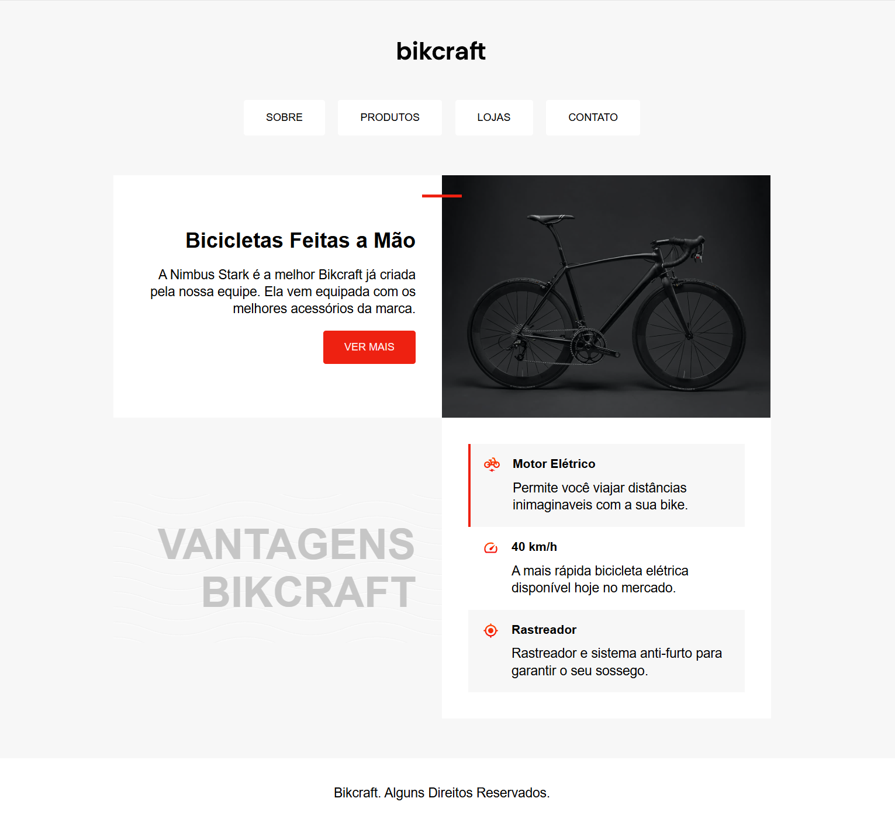

# Bikcraft - HTML Semântico & Grid Layout ♻️🚲

This project is a refactoring exercise created to reinforce semantic HTML and CSS Grid Layout concepts. The goal was to recreate the Bikcraft landing page while writing cleaner, more organized, and maintainable code.

---

## 📂 Project Structure

```text
img/
├── bicicleta.jpg
├── bikcraft.svg
├── eletrica.svg
├── rastreador.svg
├── velocidade.svg
└── onda.svg

index.html
style.css
README.md
```

---

## 📌 Features

- Semantic HTML5 structure.
- Landing page inspired by the Bikcraft layout.
- Hero section with call-to-action.
- Product advantages section.
- Layout built primarily with CSS Grid.
- Hover effects for navigation and buttons.
- Clean and organized code structure.

---

## 🎨 Design & Styling

### Layout

- CSS Grid
- Simple component organization
- Visual hierarchy
- Hover interactions

### Colors

- Primary Red: `#ee2111`
- Background: `#f7f7f7`
- White: `#ffffff`
- Black: `#000000`

### Typography

- Arial, Helvetica, sans-serif

---

## 🛠️ Technologies Used

- **HTML5** — Semantic page structure.
- **CSS3** — Styling and layout.
- **CSS Grid** — Main layout system.

---

## 🎯 Learning Goals

This project was developed to review and practice:

- Semantic HTML5.
- CSS Grid Layout.
- Page structure and organization.
- Code refactoring.
- Clean and readable CSS.
- Visual hierarchy.

> **Note:** This project is a study exercise and is **not responsive** at the current stage.

---

## 🔗 Live Preview

You can view the project here:

https://gunnaroliveira.github.io/Rafatorando-Challenger/

---

## 📥 Installation & Usage

Clone the repository:

```bash
git clone https://github.com/GunnarOliveira/Rafatorando-Challenger.git
```

Open `index.html` in your preferred browser.

---

## 👀 Screenshot



---

## 🚀 Next Steps

- Add responsive layout.
- Improve accessibility.
- Refine spacing and typography.
- Optimize the CSS architecture.

---

## 🙏 Acknowledgments

This project was developed as a review exercise to reinforce semantic HTML and CSS Grid concepts, inspired by the HTML & CSS course from **Origamid**.

---

Feel free to explore the project, share any feedback or suggestions, and don't forget,

**Jesus Loves You! ✨**
